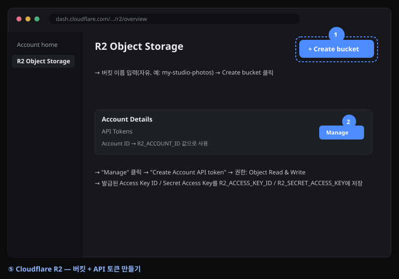
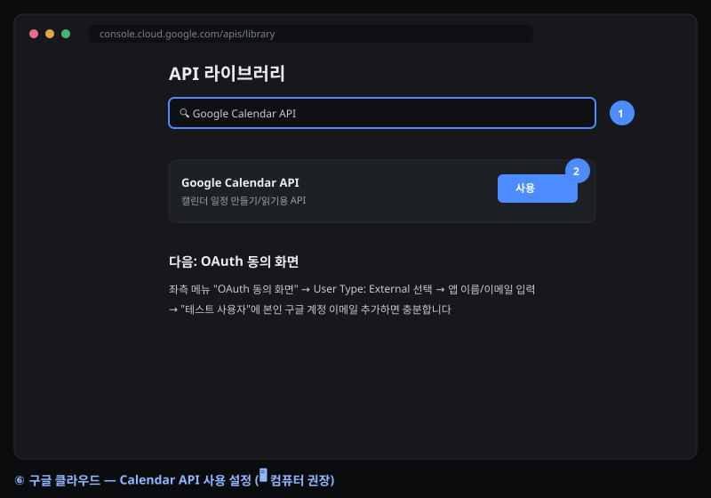
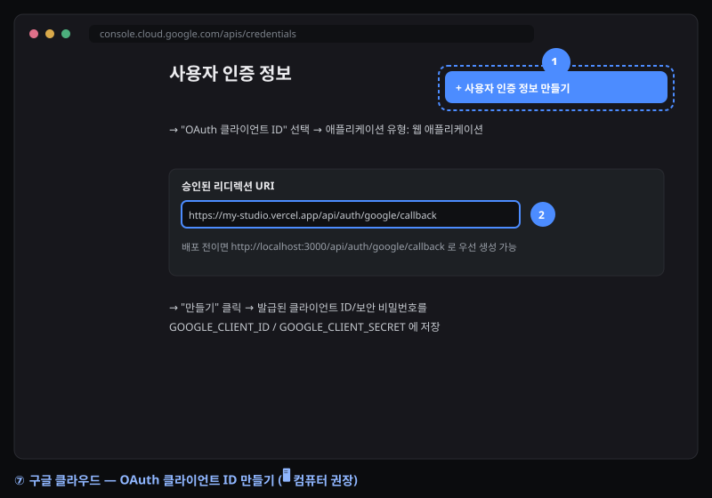
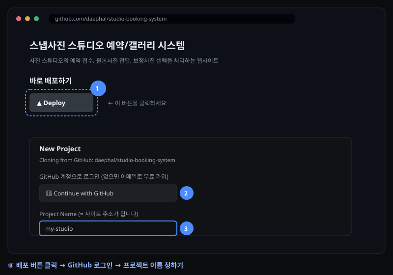
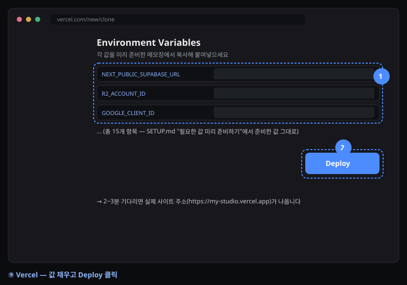
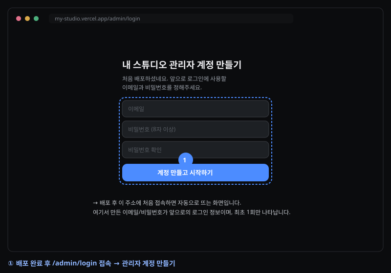
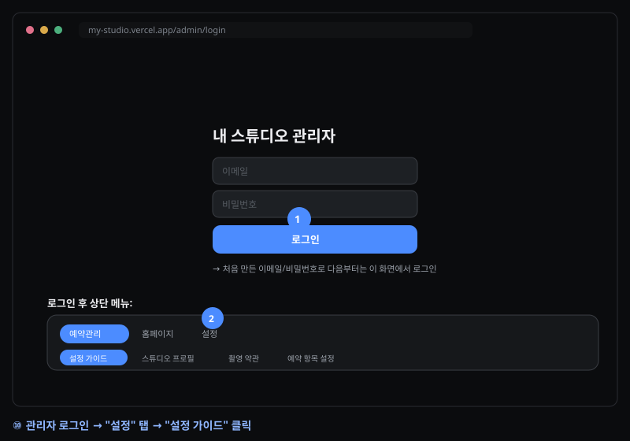
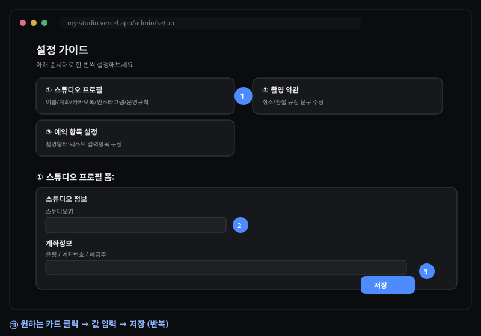

# 배포 가이드 — 처음 시작하시는 작가님을 위한 안내

아래 순서 그대로 따라오시면 나만의 예약/갤러리 사이트가 만들어집니다. 컴퓨터에 아무것도 설치할 필요 없이, 버튼 클릭 → 화면에 뜨는 빈 칸에 값 입력 → 완료됩니다.

**준비물**: GitHub 계정, Cloudflare 계정, Gmail 계정 (전부 무료, 없으면 그 자리에서 가입 가능)

> 📱 **스마트폰만으로도 대부분 가능합니다.** 딱 한 단계만 화면이 복잡해서 컴퓨터를 권장합니다 — 아래 "3. 구글 캘린더 연동"에 🖥️ 표시를 해뒀습니다. 그 외에는 전부 폰으로 진행하셔도 됩니다.

---

## 1단계 — 필요한 값 미리 준비하기

배포 버튼을 누르면 값을 입력하는 빈 칸들이 나타납니다. 아래에서 각 값을 먼저 발급받아 메모장에 적어두세요.

### Cloudflare R2 — 사진 저장소

1. https://dash.cloudflare.com 가입 → 왼쪽 메뉴 **R2** → **Create bucket** (이름 자유, 예: `my-studio-photos`)
2. **R2 → Manage R2 API Tokens → Create API Token** (권한: Object Read & Write)
3. 아래 값을 메모장에 적어두기:
   - Account ID → `R2_ACCOUNT_ID`
   - Access Key ID → `R2_ACCESS_KEY_ID`
   - Secret Access Key → `R2_SECRET_ACCESS_KEY`
   - 버킷 이름 → `R2_BUCKET`



### Gmail — 예약 알림 메일 발송

1. 알림 받을 Gmail 계정에서 **2단계 인증** 켜기 (구글 계정 설정 → 보안)
2. https://myaccount.google.com/apppasswords 접속 → 앱 비밀번호 발급 (16자리)
3. 메모장에 적어두기: `GMAIL_USER`(Gmail 주소), `GMAIL_APP_PASSWORD`(발급받은 16자리)

### 구글 캘린더 연동 (선택)

🖥️ **컴퓨터 권장** — 아래 화면은 폰에서는 메뉴 찾기가 어렵습니다.

1. https://console.cloud.google.com 접속 → 새 프로젝트 생성
2. **API 및 서비스 → 라이브러리**에서 "Google Calendar API" 검색 → 사용 설정
3. **API 및 서비스 → OAuth 동의 화면** 구성 (테스트 사용자로 본인 계정 추가)
4. **API 및 서비스 → 사용자 인증 정보 → OAuth 클라이언트 ID 만들기** (유형: 웹 애플리케이션)
   - 승인된 리디렉션 URI에 우선 `http://localhost:3000/api/auth/google/callback` 입력해 생성 (배포 주소가 정해지면 2단계 마지막에 실제 주소로 교체합니다)
   - 메모장에 적어두기: `GOOGLE_CLIENT_ID`, `GOOGLE_CLIENT_SECRET`

 

캘린더 연동을 안 쓰신다면 이 항목은 건너뛰고, 배포 버튼 화면에서 관련 빈 칸을 비워두면 됩니다.

### 보안용 랜덤 값 만들기

`GALLERY_SESSION_SECRET`, `CRON_SECRET`은 아무 값이나 넣어도 되는 "비밀 문자열"입니다. https://www.uuidgenerator.net 에서 UUID를 2개 만들어 하이픈(`-`)만 지우고 각각 넣으세요.

---

## 2단계 — 배포 버튼으로 배포하기

1. 아래 버튼 클릭

   [](https://vercel.com/new/clone?repository-url=https%3A%2F%2Fgithub.com%2Fdaephal%2Fstudio-booking-system&env=NEXT_PUBLIC_SITE_URL%2CR2_ACCOUNT_ID%2CR2_ACCESS_KEY_ID%2CR2_SECRET_ACCESS_KEY%2CR2_BUCKET%2CGMAIL_USER%2CGMAIL_APP_PASSWORD%2CGOOGLE_CLIENT_ID%2CGOOGLE_CLIENT_SECRET%2CGOOGLE_REDIRECT_URI%2CGALLERY_SESSION_SECRET%2CCRON_SECRET&envDescription=%EA%B0%81%20%EA%B0%92%EC%9D%84%20%EC%96%B4%EB%94%94%EC%84%9C%20%EA%B5%AC%ED%95%98%EB%8A%94%EC%A7%80%EB%8A%94%20SETUP.md%EB%A5%BC%20%EC%B0%B8%EA%B3%A0%ED%95%98%EC%84%B8%EC%9A%94&envLink=https%3A%2F%2Fgithub.com%2Fdaephal%2Fstudio-booking-system%2Fblob%2Fmain%2FSETUP.md&project-name=my-studio&repository-name=my-studio&stores=%5B%7B%22type%22%3A%20%22integration%22%2C%20%22integrationSlug%22%3A%20%22supabase%22%2C%20%22productSlug%22%3A%20%22supabase%22%2C%20%22protocol%22%3A%20%22storage%22%7D%5D)



2. GitHub 계정으로 로그인 (없으면 "Sign up"에서 이메일로 무료 가입)
3. 프로젝트 이름 정하기 (예: `my-studio`) — **이 이름이 사이트 주소가 됩니다** (`https://my-studio.vercel.app`)
4. **"Add Products" 화면**에서 "Supabase" 카드 옆 **Add** 클릭 → 약관 동의(Accept and Create) → Plan은 **Free Plan** 선택 → **Continue** (DB가 자동으로 만들어집니다)
5. 빈 칸(Environment Variables)에 1단계에서 준비한 값을 채워 넣기
   - `NEXT_PUBLIC_SITE_URL` → `https://my-studio.vercel.app` (3번에서 정한 이름으로)
   - `GOOGLE_REDIRECT_URI` → `https://my-studio.vercel.app/api/auth/google/callback`
   - 구글 캘린더 연동을 안 쓴다면 관련 칸은 비워두기



6. **Deploy** 클릭 → 2~3분 대기
7. 배포 완료 후 뜨는 실제 사이트 주소를 확인. 3번에서 예상한 이름과 다르면(이미 사용 중이었던 경우), Vercel 프로젝트의 **Settings → Environment Variables**에서 `NEXT_PUBLIC_SITE_URL`, `GOOGLE_REDIRECT_URI`를 실제 주소로 수정 후 **Redeploy**
8. 확정된 실제 주소로 마무리하기:
   - Cloudflare R2 버킷 → **Settings → CORS Policy**에 아래 추가
     ```json
     [{ "AllowedOrigins": ["https://my-studio.vercel.app"], "AllowedMethods": ["GET", "PUT"], "AllowedHeaders": ["*"] }]
     ```
   - (구글 캘린더 연동 시) 구글 클라우드 콘솔 → OAuth 클라이언트 → 승인된 리디렉션 URI에 `https://my-studio.vercel.app/api/auth/google/callback` 추가

---

## 3단계 — 스튜디오 정보 입력하기

 



1. `https://my-studio.vercel.app/admin/login` 접속 → "관리자 계정 만들기" 화면에서 이메일/비밀번호 정하기 (최초 1회만 나타남, 이후 로그인 정보)
2. 상단 메뉴 **설정 → 설정 가이드**를 클릭 → 순서대로 입력
   - **스튜디오 프로필**: 이름, 카카오톡, 인스타그램, 입금 계좌
   - **촬영 약관**: 취소/환불 규정 문구 수정
   - **예약 항목 설정**: 촬영형태 종류, 예약 폼 텍스트 항목
   - **구글 캘린더 연동**: 연동 버튼 클릭 (설정했다면)
   - **테마 설정**: 사이트 색상
3. `/booking`에서 예약 테스트 → 관리자 대시보드(`/admin`)에서 확인

이 순서(정보 입력 후 공개)를 지키면 예시 정보가 손님에게 보이지 않고 바로 실제 정보로 시작할 수 있습니다.

---

## 나중에 업데이트하기

배포 이후 시스템에 새로운 기능이 추가되면, 아래 방법으로 코드만 최신 버전으로 교체할 수 있습니다. 스튜디오 프로필·계좌·약관·색상 등 관리자 화면에서 입력한 내용은 전부 데이터베이스에 저장되어 있어서, 코드를 교체해도 전혀 영향받지 않습니다.

1. https://github.com/daephal/studio-booking-system 접속 → 초록색 **Code** 버튼 → **Download ZIP**
2. 다운로드된 zip 파일 더블클릭 → 압축 풀기
3. 배포할 때 만든 **본인의 GitHub 저장소**(`my-studio` 등) 접속
4. **Add file → Upload files** 클릭
5. 방금 압축 푼 폴더 전체를 화면에 드래그 앤 드롭 (하위 폴더까지 그대로 올라갑니다)
6. 아래 **Commit changes** 클릭

커밋하면 Vercel이 자동으로 감지해서 몇 분 내로 재배포합니다. 별도로 할 일은 없습니다.
